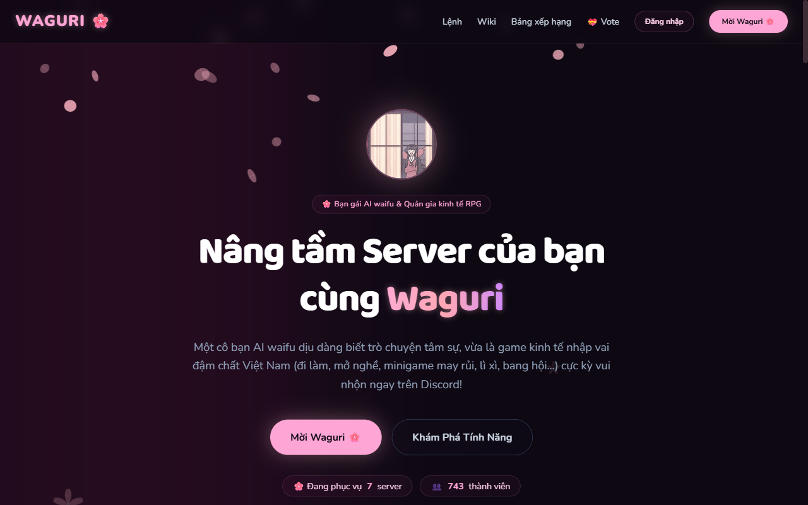

# 🌸 Waguri — Discord Economy / RPG / Community Bot (Vietnamese)

[](https://discord.js.org)
[](https://supabase.com)
[](https://nodejs.org)

<p align="center">
  <a href="https://waguri-bot.vercel.app">
    
  </a>
  <br>
  <sub><a href="https://waguri-bot.vercel.app">waguri-bot.vercel.app</a> — dashboard, bảng xếp hạng, quản lý Premium</sub>
</p>

**Waguri** là một Discord bot **kinh tế · nhập vai · cộng đồng** bản địa hoá đậm chất Việt Nam, kèm
**AI trò chuyện** mang persona dịu dàng, lễ phép, hay động viên (lấy cảm hứng từ nhân vật **Waguri Kaoruko**).
Từ nghề vỉa hè (nhặt ve chai, bán trà đá) leo lên đại gia, lập bang hội, chơi Loto/Bingo trong voice,
chơi minigame nhiều người, kết đôi, buôn bán… — tất cả bằng tiếng Việt.

> **Vòng lặp lõi:** Làm việc → kiếm VNĐ → mua sắm / chế đồ / lên cấp → mở nghề xịn → flex trên bảng xếp hạng.
> Cân bằng **hardcore** (năng lượng, mệt mỏi, sinh tử) nhưng **chống lạm phát** bằng nhiều tầng sink.

---

## ✨ Tính năng (72 lệnh slash chuẩn hóa)

| Nhóm | Lệnh tiêu biểu |
|---|---|
| 💼 **Kinh tế & Nghề** | `/work` `/fish` `/mine` `/chop` `/daily` `/quest` `/jobs` `/pet` `/prestige` `/relief` — năng lượng, mệt mỏi, chuyển sinh & trợ cấp phá sản |
| 🏪 **Cửa hàng & Kho** | `/store` `/market` *(chợ nông sản biến động MurmurMix32)* `/inventory` `/album` `/pass` `/eat` `/rest` `/cosmetic` `/craft` `/repair` `/hospital` |
| 💸 **Giao dịch & Tín dụng** | `/give` `/bank` `/rob` `/loan` *(Quỹ tín dụng học đường Kikyo)* `/gift` *(tặng vật phẩm)* |
| 🍰 **Nuôi trồng & Tiệm bánh** | `/farm` *(nông trại Kikyo: lúa mì & dâu tây)* · `/bakery` *(Tiệm Bánh Gekka mở từ Cấp 3: nướng bánh thụ động & đơn hàng VIP)* |
| 🎲 **Minigame & Cược** | `/blackjack` *(xì dách bài tây emoji)* `/taixiu` `/baucua` `/coinflip` `/crate` `/loto` *(voice)* `/masoi` *(ma sói)* |
| 🎀 **Vui & Cộng đồng** | `/trivia` *(đố vui)* `/wordchain` *(nối từ)* `/fortune` *(bói toán)* `/lunar` *(âm lịch)* `/lixi` `/couple` `/action` `/confession` *(AI an ủi)* `/study` *(Pomodoro 24/7)* |
| 💬 **AI & Hẹn hò** | `/ask` + @tag Waguri trò chuyện có trí nhớ · `/premium` *(ưu đãi AI & kinh tế)* · `/dating` *(hẹn hò bồi đắp tình cảm)* |
| 🖼️ **Ảnh & Tiện ích** | `/image` `/weather` *(thời tiết)* `/claim-support` `/announcement` *(thông báo cập nhật)* |
| ⚙️ **Quản trị & Thông tin** | `/setup` `/config` `/serverinfo` `/antinuke` *(chống nuke server)* · `/leaderboard` `/start` `/ticket` `/vote` `/bot` `/help` |

**Hệ thống nền:** năng lượng & hồi phục khi ngủ `/rest` · mệt mỏi giảm thu nhập · sức khỏe & nhập viện ·
độ bền & sửa công cụ · thú cưng 3 giai đoạn & cây kỹ năng · **chống lạm phát**
(thuế tài sản, không P2P loan lạm dụng, sink đa tầng) · **chống lạm dụng** (rate-limit, ban, kiểm tra điều kiện cốt truyện) ·
**sự kiện x2** toàn cục · **graceful shutdown**.

---

## 🧠 Kiến trúc

- **discord.js v14** — Slash **và** prefix (`w!`) song song qua `prefixShim`; tương tác bằng modal/button/select/collector.
- **Atomic-first**: mọi thao tác tiền/EXP/kho/quỹ chạy bằng **RPC PostgreSQL nguyên tử** (chống dupe & race condition).
- **Config tập trung** ở `src/config/index.js` — tinh chỉnh toàn bộ cân bằng game tại 1 chỗ.
- **AI Gemini** — persona Waguri trò chuyện qua Google Gemini kèm hệ thống ghi nhớ `ai_memory`.
- **Embed chuẩn hoá** qua `src/lib/embed.js` (`buildWaguriEmbed`): màu theo trạng thái + ảnh/GIF Waguri + footer cá tính.
- **Logic thuần tách riêng** (leveling, market, fatigue, masoi engine…) → phủ **572 automated tests** (`npm test`).

```text
waguri/
├── index.js                  # Nạp lệnh + đăng ký slash + nạp event + scheduler
├── src/
│   ├── config/index.js       # ⚙️ Toàn bộ hằng số cân bằng + WAGURI_IMAGES
│   ├── database.js           # Helper Supabase (gọi RPC nguyên tử)
│   ├── lib/                  # embed, leveling, fatigue, market, lobby, couple, loto, masoi, ...
│   ├── commands/{economy,games,fun,utility,admin,owner}/*.js
│   └── events/{ready,interactionCreate,messageCreate,guildCreate}.js
├── archive/                  # 📦 Lưu kho an toàn các lệnh và tính năng cũ
├── supabase/migrations/      # 0001 → 0161 (schema + RPC nguyên tử; idempotent)
└── test/*.test.js            # Test suite tự động (572 tests, 100% pass)
```

---

## 🚀 Cài đặt & chạy

### 1) Discord Developer Portal
1. [Tạo Application](https://discord.com/developers/applications) → tab **Bot** → **Reset Token** (= `DISCORD_TOKEN`).
2. **Bật Privileged Intent: `MESSAGE CONTENT`** *(bắt buộc — dùng cho lệnh prefix `w!` & trò chuyện khi @tag)*.
3. Mời bot bằng `/invite` (link tự sinh, kèm sẵn quyền). Quyền cần: gửi tin/embed, **Quản lý Kênh** + **Quản lý Vai trò** (cho `/setup`), **Moderate Members** (tạm giam khi bị công an bắt).

### 2) Biến môi trường (`.env`)
| Biến | Bắt buộc | Ghi chú |
|---|---|---|
| `DISCORD_TOKEN` | ✅ | Token bot |
| `SUPABASE_URL`, `SUPABASE_SERVICE_KEY` | ✅ | Từ Supabase Project Settings |
| `GEMINI_API_KEY` *(hoặc key provider AI)* | ✅* | Cho `/ask` & @tag (quota free 15/ngày) |
| `OWNER_IDS` | ❌ | **Tuỳ chọn** — chủ app **tự nhận** là owner; chỉ thêm khi muốn cấp quyền cho người khác |
| `CLIENT_ID` | ❌ | Tự suy từ token nếu bỏ trống |
| `GUILD_ID` | ❌ | **Chỉ DEV** — đăng ký lệnh tức thì 1 server |
| `SKIP_DEPLOY` | ❌ | `=1` để bỏ qua đăng ký lệnh mỗi lần restart (đặt sau lần deploy đầu) |

### 3) Database (1 lần)
Chạy lần lượt các file trong `supabase/migrations/` (`0001` → `0074b`) trên **Supabase SQL Editor**
(hoặc Supabase CLI). Đã được thiết kế idempotent (`create ... if not exists` / `or replace`).

### 4) Chạy
```bash
npm install
npm run dev     # DEV: nodemon + GUILD_ID để lệnh cập nhật tức thì
npm start       # PROD
npm test        # unit test
```

---

## ☁️ Deploy (Wispbyte / panel Pterodactyl)
- Node **≥ 20**. Startup: `npm install && npm start`. Khai báo env trên panel (KHÔNG commit `.env`).
- Cập nhật: `git push` → **Restart** (panel `git pull`). Lệnh không đổi thì đặt `SKIP_DEPLOY=1`.
- Lần đầu lên production: **bỏ `GUILD_ID`** để đăng ký lệnh global (mất ~1h Discord cache).

---

## 🎱 Loto (chơi trong voice)
`/loto` mở phòng chơi Lô tô tương tác, mỗi người mua vé **5 số 01–90**, vào voice để cùng quay số và so khớp nhận thưởng.
Yêu cầu người mở game phải **ở trong phòng voice**.

---

## 🔗 Liên kết

- **Web:** https://waguri-bot.vercel.app
- **Danh sách lệnh:** https://waguri-bot.vercel.app/commands
- **Bảng xếp hạng:** https://waguri-bot.vercel.app/leaderboard
- **Mời bot:** dùng `/invite` trong Discord (link tự sinh kèm quyền)
- **Server hỗ trợ:** link trong biến môi trường `SUPPORT_INVITE` (`.env`)

---

## 📄 License
MIT — xem file `LICENSE`. *(Áp dụng cho **mã nguồn**, không bao gồm nhân vật/hình ảnh có bản quyền.)*

## ⚖️ Bản quyền & Ghi nhận
Waguri lấy cảm hứng từ nhân vật **Waguri Kaoruko** trong *"The Fragrant Flower Blooms with Dignity"* (Kaoru Hana wa Rin to Saku). Đây là **sản phẩm fan**, **không** có liên kết chính thức với tác giả/nhà xuất bản và **không** sở hữu bản quyền nhân vật. Mọi quyền với nhân vật thuộc về chủ sở hữu hợp pháp.

> 🌸 *"Cố lên nhé! Hôm nay cậu đã vất vả rồi, Waguri luôn ở sau cổ vũ cậu!"*
